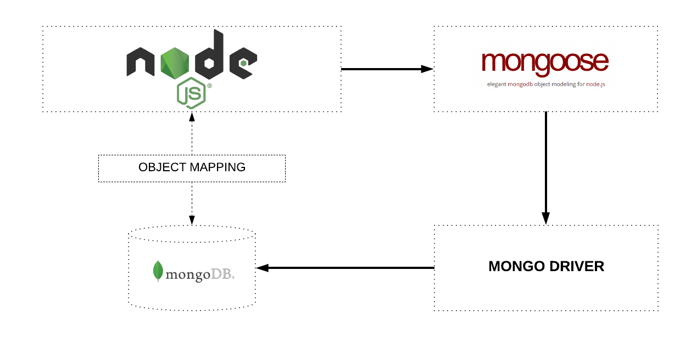

# Mongoose
**Mongoose** is an Object Data Modeling (ODM) library for MongoDB and Node.js. It manages relationships between data, provides schema validation, and is used to translate between objects in code and the representation of those objects in MongoDB.



## Setup

Install Mongoose API package:
```
$ npm i mongoose
```

In the main `app.js`, require in the Mongoose package, and create a new instance:
```js
const mongoose = require('mongoose')

mongoose.connect('mongodb://localhost:27017/pokedex');
```

A new model will need to be created. By convention a separate `models/` folder should be created to store all of our models, each file representing a model should be capitalised (as it is usually represented as a class).

Note: By convention, models will be referred to in the singular, but pluralised when referring to a collection. 

In the `Pokemon.js` file representing the model:
```js
const mongoose = require('mongoose');

const pokemonSchema = new mongoose.Schema({
  id: Number,
  name: String
});

module.exports = mongoose.model('Pokemon', pokemonSchema);
```

In the `api.js` file, require in the module containing the Pokemon model:
```js
const Pokemon = require('./models/Pokemon');
```

To setup RESTful routes to the MongoDB database using Mongoose in the Express API:

```js
// 'GET': TO SHOW ALL POKEMON IN THE ARRAY @ '/pokemon'
app.get('/pokemon', (req, res) => {
    Pokemon.find({})
        .then(docs => res.send(docs));
});

// 'GET': TO SHOW AN INDIVIDUAL POKEMON IN THE ARRAY @ '/pokemon/:id'
app.get('/pokemon/:id', (req, res) => {
    const { id } = req.params;
    Pokemon.findOne({id})
        .then(doc => res.send(doc));
});

// 'POST': TO ADD A NEW POKEMON TO OUR ARRAY at '/pokemon'
app.post('/pokemon', (req, res) => {
    const { id, name } = req.body;
    const newPokemon = new Pokemon({ id, name });
    newPokemon.save()
        .then(doc => res.send(doc));
});

// 'PUT': TO UPDATE AN EXISTING POKEMON IN THE ARRAY at '/pokemon/:id'
app.put('/pokemon/:id', (req, res) => {

    const { id } = req.params;
    const { name } = req.body;
    
    Pokemon.findOneAndUpdate(
        { id },
        { id, name },
        {
            new: true,
            runValidators: true
        }
    )
        .then(doc => res.send(doc));
});

// 'DELETE': TO DELETE A POKEMON FROM THE ARRAY at /pokemon/:id
app.delete('/pokemon/:id', (req, res) => {
    const { id } = req.params;

    Pokemon.findOneAndRemove({ id })
        .then(deletedDoc => res.send(deletedDoc))
      
});
```

In a new Terminal tab, run:
```
$ node api.js
```
Via `api.js`, port 5000 is waiting and listening for HTTP requests.


In two other tabs, run:
```
$ mongod
$ mongo
```
Via the `mongo` and `mongod` sesssions running, port 27017 is waiting and listening for MongoDB requests.